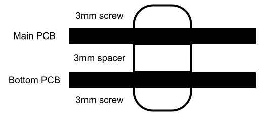
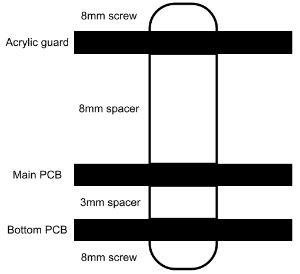

# Putting it All Together

There are two main ways to attach the top PCB to the bottom PCB.
One is the way described in the Plaid
[build guide](https://github.com/hsgw/plaid/blob/master/doc/en/complete.md),
which takes advantage of the fact that a M2 nut is 1.6mm high, and so is the
PCB. Thus, 2 PCB layers and 3 nuts are exactly 5*1.6mm = 8mm high.
So a 8mm M2 screw inserted from the top of the top PCB, two nuts between it and
the bottom PCB, and then fastened with the final nut will exactly fit.
However, in my experience, the nuts fall out.

A different way to attach the two PCBs together is with a 3mm spacer.
2*1.6mm + 3mm = 6.2mm, so the screws have to be less than 3.1mm long.
First, insert one 3mm screw from the top of the top PCB, and screw the spacer
onto it. Then, screw another 3mm screw from the bottom of the bottom PCB into
the existing spacer and it will fasten.

To install the acrylic guard, use an 8mm screw instead of a 3mm screw going
from the bottom PCB to the top PCB, and simply screw the 10mm spacers onto
this screw. From there, place the acrylic guard over the four spacers, making
sure the rounded corners are at the top left and right. Screw 4 8mm screws
downwards, securing the acrylic guard. I recommend half-screwing each screw into
its spacer first, to make sure all screws can go in, and then fully screwing
all four screws after they are all in place.

